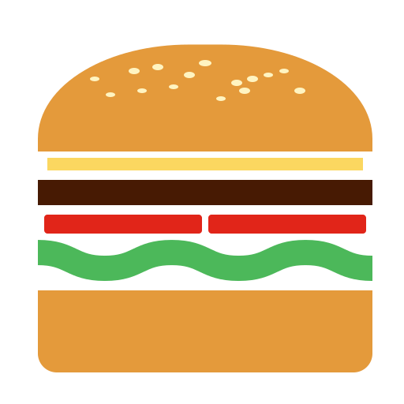

# <sub></sub> Pick & Take Burger

[](https://react.dev/)
[](https://www.typescriptlang.org/)
[](https://vitejs.dev/)
[](https://redux-toolkit.js.org/)
[](https://reactrouter.com/)
[](https://getbootstrap.com/)
[](https://ypinpin.github.io/pick-take-burger/)
[](https://github.com/YPINPIN/pick-take-burger/commits/main)

一個基於 **React + TypeScript + Vite** 建立的互動式線上點餐系統，提供用戶方便地瀏覽菜單、加入購物車並完成訂單流程，同時包含後台管理功能。

> 此專案為 **六角學院 2025 冬季｜React 作品實戰班** 之最終作品（含前、後台），後端 API 使用六角學院提供的課程 API。

[💻 **線上 Demo**](https://ypinpin.github.io/pick-take-burger/)

---

## 📸 Demo 預覽

### 前台


### 後台


---

## ✨ 專案介紹

### 前台（用戶端）

- 🏠 **首頁**：Hero Video Banner、人氣餐點輪播、限時優惠券、點餐四步驟說明
- 🍔 **美味 MENU**：依分類瀏覽商品，支援分頁切換，標示熱銷／主廚推薦／新品上市等標籤
- 📖 **品牌故事**：品牌誕生理念、食材品質堅持、外送體驗與品牌名稱寓意介紹
- 🛒 **購物車**：調整餐點數量、輸入優惠券、確認訂單摘要
- 📝 **結帳頁面**：填寫訂購人資訊與送餐地址後送出訂單完成付款
- 🔍 **追蹤訂單**：輸入訂單編號查詢即時進度與訂單明細
- 📱 **響應式設計**：支援桌機與行動裝置，提供流暢的使用者體驗

### 後台（管理端）

- 🔐 **登入 / 登出**：管理員帳號密碼驗證
- 🍔 **產品管理**：可依分類篩選、新增／編輯／刪除產品
- 📦 **訂單管理**：可依訂單編號查詢、查看訂單詳情與更新即時狀態，支援刪除單筆或清空全部訂單
- 🎟️ **優惠券管理**：新增／編輯／刪除優惠券

---

## 🎨 設計與素材來源

| 素材              | 工具                                                                                             |
| ----------------- | ------------------------------------------------------------------------------------------------ |
| 產品圖片與 Banner | [Whisk](https://labs.google/fx/zh/tools/whisk)、[Google Gemini](https://gemini.google.com/) 生成 |
| Logo              | [ChatGPT](https://chatgpt.com/) 生成                                                             |
| 首頁影片          | [Pika](https://pika.art/) 生成                                                                   |
| 畫面設計          | [Google Stitch](https://stitch.withgoogle.com/) 輔助設計                                         |

---

## 🛠️ Tech Stack

### Core

[](https://react.dev/)
[](https://www.typescriptlang.org/)
[](https://vitejs.dev/)

### State Management

[](https://redux-toolkit.js.org/)
[](https://react-redux.js.org/)

### Routing

[](https://reactrouter.com/)

### UI & Styling

[](https://getbootstrap.com/)
[](https://icons.getbootstrap.com/)
[](https://motion.dev/)
[](https://swiperjs.com/)
[](https://sass-lang.com/)

### HTTP

[](https://axios-http.com/)

### Form

[](https://react-hook-form.com/)

### Misc

[](https://mhnpd.github.io/react-loader-spinner/)

---

## 📁 專案結構

```
pick-take-burger/
├── public/            # 公用靜態資源 (favicon、圖片)
├── src/
│   ├── api/           # API 請求定義
│   ├── components/    # React 元件
│   ├── hooks/         # 自定義 Hooks
│   ├── pages/         # 頁面元件
│   ├── scss/          # SCSS 樣式
│   ├── slices/        # Redux slices
│   ├── types/         # TypeScript 型別定義
│   ├── utils/         # 工具方法
│   ├── store.ts       # Redux Store
│   ├── routes.ts      # React Router 設定
│   ├── App.tsx        # 主應用元件
│   └── main.tsx       # 應用程式入口
│
├── .env               # 環境變數 (需自行添加)
├── package.json       # 專案依賴
├── tsconfig.json      # TypeScript 設定
├── vite.config.ts     # Vite 設定
└── README.md          # 專案說明文件
```
